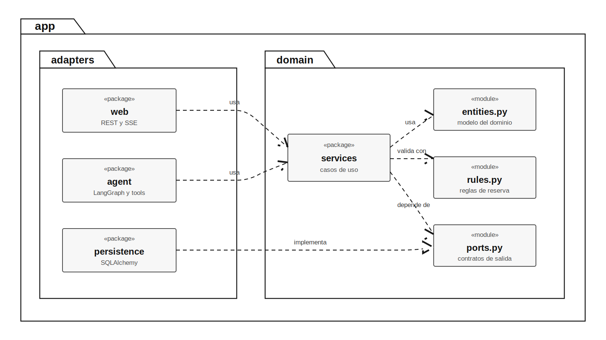
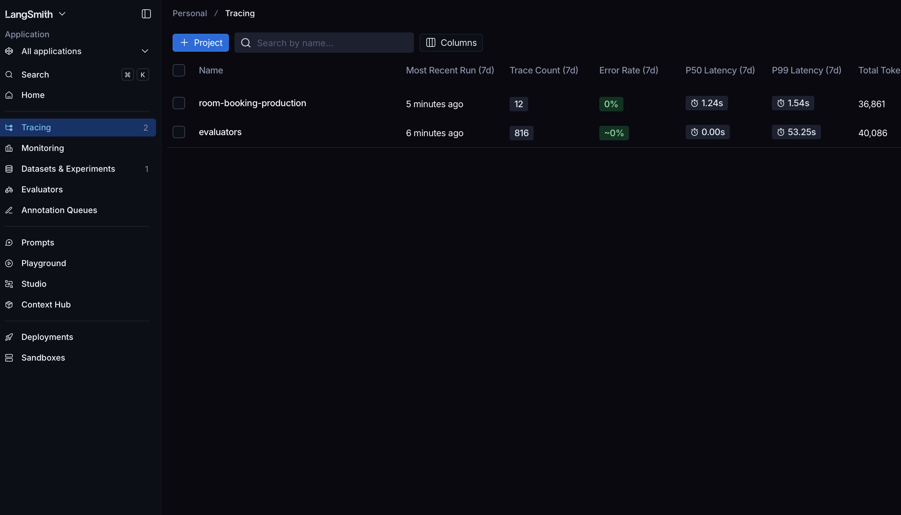
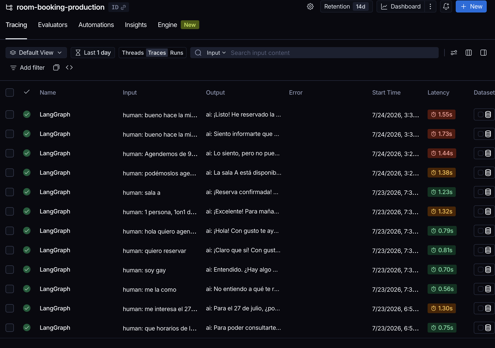
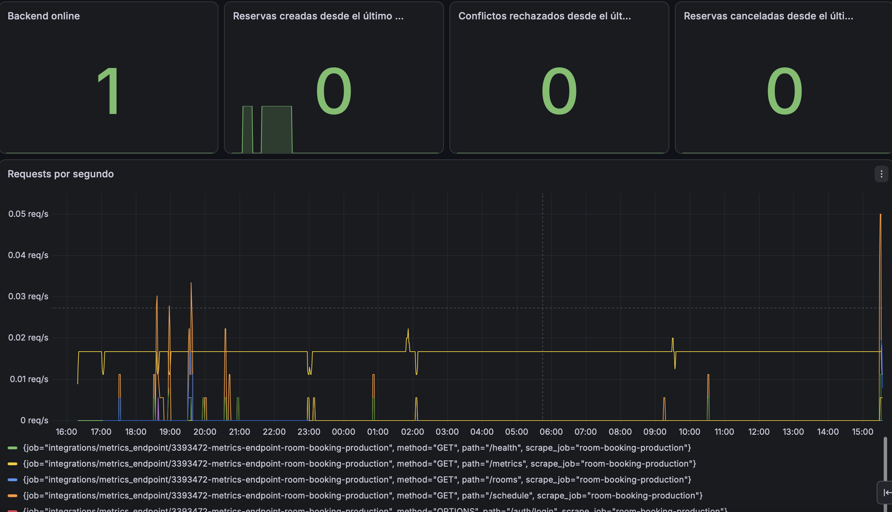
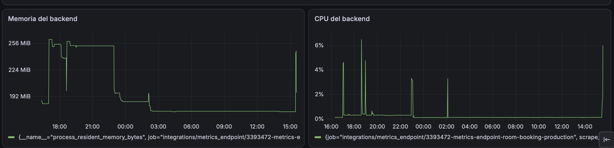
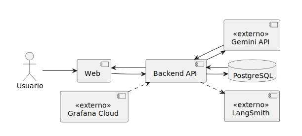
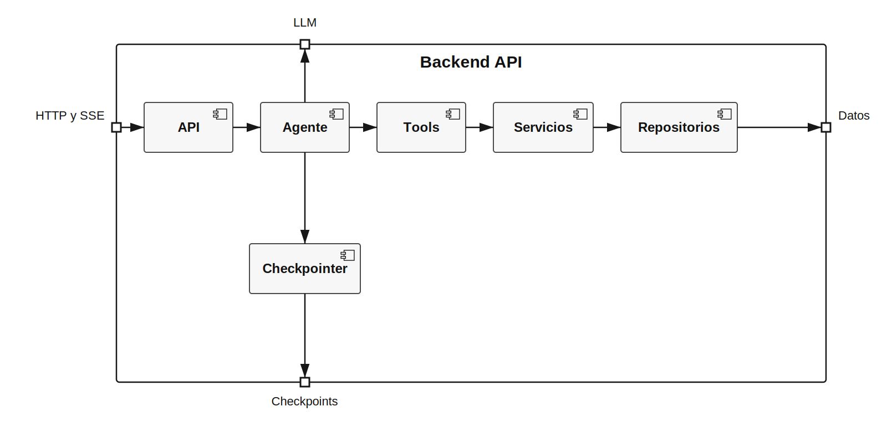

# Project Overview

## Enfoque de la solución

El challenge consistía en construir un sistema de reserva de salas que pudiera usarse mediante un chatbot. Separé la interpretación del lenguaje natural de las reglas que deciden si una reserva es válida. El agente entiende el pedido y elige una acción, pero no modifica la base de datos directamente. Para consultar, crear o cancelar una reserva tiene que ejecutar una tool, y esa tool llama a los mismos servicios de dominio que utiliza el resto del backend.

Las reglas de capacidad, horarios, duración, propiedad y solapamiento no quedaron dentro del prompt ni dependen de que el modelo las recuerde. Las implementé en el dominio para que siempre se apliquen de la misma manera. PostgreSQL agrega una protección final frente a operaciones concurrentes y evita que dos solicitudes que llegan casi al mismo tiempo creen reservas incompatibles.

### Arquitectura hexagonal

Elegí una arquitectura hexagonal para que las reglas del negocio no dependieran de FastAPI, LangGraph, SQLAlchemy o PostgreSQL. El dominio define los casos de uso y los puertos que necesita. Los componentes externos se conectan mediante adaptadores.

Esta separación me permitió probar los servicios con repositorios en memoria y un reloj fijo. Así pude comprobar las reglas sin levantar PostgreSQL ni depender de la hora real. También hace que los cambios queden más acotados. Puedo cambiar el proveedor del modelo, la persistencia o la interfaz desde la que se inicia una reserva sin reescribir las reglas principales.

El diagrama muestra los paquetes y módulos que explican la dirección de las dependencias. `web` contiene la API REST y el streaming por SSE. `agent` contiene el guard, el grafo y las tools. Ambos utilizan los servicios del dominio para ejecutar los casos de uso.

Dentro del dominio, `services` utiliza las entidades, aplica las reglas y depende de los contratos definidos en `ports.py`. `persistence` contiene los repositorios de SQLAlchemy y realiza esos contratos. Los servicios conocen las interfaces que necesitan, mientras que PostgreSQL y SQLAlchemy quedan detrás de una implementación que puede cambiar sin modificar las reglas del negocio.

Los elementos marcados como `«package»` corresponden a paquetes del código. Los marcados como `«module»` corresponden a archivos Python con una responsabilidad concreta. Las flechas punteadas muestran dependencias de código y la flecha con triángulo vacío muestra que `persistence` implementa los puertos del dominio.

FastAPI y las tools funcionan como entradas porque inician casos de uso. SQLAlchemy funciona como salida porque implementa los puertos de persistencia que necesita el dominio.

### Agente conversacional

Elegí LangGraph con un flujo ReAct. Un tool calling simple podía resolver el alcance actual, pero el grafo me permitía dejar visible el recorrido entre el guard, el modelo y las tools, conservar el estado de cada conversación y transmitir eventos mientras se ejecutaba.

El guard revisa el mensaje antes de llamar al modelo. Luego Gemini puede responder o pedir una tool. Si pide una operación, el grafo la ejecuta y devuelve el resultado al modelo para que prepare una respuesta entendible para el usuario. El modelo utilizado es Gemini, aunque la inicialización mediante LangChain evita que el resto de la aplicación quede unido directamente a un proveedor.

### Streaming y sincronización

La respuesta del chatbot se envía mediante Server-Sent Events. El frontend no espera a que el modelo termine todo el mensaje. Procesa tokens y eventos de tools a medida que llegan.

Cuando una operación modifica una reserva, el backend emite un evento `booking_changed`. El frontend recibe ese evento e invalida la consulta de la agenda con TanStack Query. La grilla vuelve a consultar el backend y queda sincronizada con lo que ocurrió en el chat sin recargar toda la página.

### Evaluaciones y LangSmith

Usé LangSmith para dos necesidades relacionadas con el agente. Por un lado recibe las trazas de las conversaciones y permite revisar qué hizo el grafo, qué tools eligió, con qué argumentos y cuánto demoró cada paso. Por otro lado guarda los datasets y experimentos de evaluación.

Los 30 casos de evaluación viven versionados en el repositorio. Antes de cada experimento los sincronizo con LangSmith usando identificadores estables. De esta forma el código sigue siendo la fuente de verdad y LangSmith conserva la ejecución, las métricas y la comparación entre experimentos.

Cuando un PR modifica el agente, el CI ejecuta una suite smoke de ocho casos representativos con el modelo real. Esa suite controla de forma objetiva la selección de tools, los argumentos y el comportamiento seguro. Esos resultados funcionan como quality gate y permiten detectar las regresiones principales sin hacer demasiado lento cada PR.

Dejé la evaluación de los 30 casos como un workflow manual porque cada caso puede necesitar más de una llamada al modelo y la suite completa agrega otra llamada del LLM as judge por cada respuesta. Ejecutarla en todos los PR aumenta bastante el tiempo de espera, consume la cuota gratuita del proveedor y expone el pipeline a límites temporales de la API aunque el código esté bien.

La ejecuto antes de un release y cuando cambia el modelo, el prompt, las tools, el dataset o los criterios de evaluación. La suite completa vuelve a controlar las métricas objetivas sobre los 30 casos y además usa el juez para puntuar claridad, corrección, foco en el problema y lenguaje entendible para el usuario.

Dejé los puntajes del juez como información y no como bloqueo automático porque una evaluación realizada por otro LLM puede variar entre ejecuciones. Los controles de tool, argumentos y seguridad sí bloquean porque se comparan contra resultados concretos. Si los puntajes del juez se vuelven estables después de varias ejecuciones, puedo definir umbrales confiables y convertirlos también en una condición del release.

La vista de proyectos permite separar las trazas de producción de las ejecuciones que corresponden a las evaluaciones.

Dentro del proyecto de producción puedo revisar cada ejecución del grafo, su entrada, su respuesta y el tiempo que demoró.

### Observabilidad

Separé la observabilidad operativa de la observabilidad del agente. Prometheus y Grafana Cloud muestran requests, uso de memoria y CPU, reservas creadas, cancelaciones y conflictos rechazados. LangSmith muestra el recorrido interno del agente y los resultados de sus evaluaciones.

Esta separación permite distinguir un problema de infraestructura de un problema en el comportamiento del modelo. Una respuesta incorrecta puede aparecer en LangSmith aunque el backend esté saludable. Del mismo modo, Grafana puede mostrar errores o un aumento de memoria aunque el agente esté eligiendo las tools correctas.

El dashboard muestra en una sola vista el estado del backend, los contadores funcionales y la actividad de los endpoints.

También permite seguir el consumo de memoria y CPU del proceso desplegado.

### Integración y despliegue

Frontend y backend tienen repositorios, imágenes Docker y pipelines separados. En cada PR, GitHub Actions ejecuta las verificaciones correspondientes. El backend corre Ruff, mypy, pytest y las evaluaciones smoke cuando el cambio afecta al agente. El frontend ejecuta lint, build, Vitest y valida la configuración de Playwright.

La rama `main` está protegida y el deploy solamente comienza después de que el CI termina correctamente sobre un push a esa rama. El workflow registra primero el identificador del deployment que está activo y luego publica la nueva versión en Railway.

Después del deploy ejecuto smoke tests contra la URL real de producción. En el backend verifico el health check, el rechazo de solicitudes anónimas, el login, el catálogo de salas y la agenda autenticada. En el frontend Playwright abre la aplicación, inicia sesión y comprueba que la agenda se cargue sin errores.

Si el smoke test falla, el workflow utiliza el identificador guardado para pedir a Railway un rollback. Después espera que la versión anterior quede activa y repite la verificación funcional. Esto no mantiene dos ambientes encendidos todo el tiempo, pero permite recuperar la última versión conocida sin sostener el costo permanente de una estrategia blue-green.

Los secretos no viven en el código. Railway guarda las variables que necesita la aplicación en ejecución y GitHub guarda los tokens y credenciales que utilizan los workflows. Las variables no sensibles, como las URLs y los identificadores de servicios, se mantienen separadas de los secrets.

## Diagrama general de componentes

Este diagrama muestra los componentes desplegados y los servicios externos que participan mientras el usuario realiza una consulta. El usuario se representa como actor y no como parte de la solución.

La aplicación web se comunica únicamente con la API. El backend concentra la autenticación, la coordinación del agente y las reglas del negocio. Gemini participa en la interpretación y generación de la respuesta. PostgreSQL conserva los datos de reservas y el estado de las conversaciones. LangSmith y Grafana observan el recorrido desde perspectivas diferentes, pero no toman decisiones dentro de él.

## Componentes internos del backend

Este diagrama toma a `Backend API` como límite y muestra solamente su organización interna. Los cuadrados ubicados sobre el borde representan sus puertos de entrada y salida. `HTTP y SSE` conecta la comunicación web, `LLM` conecta al agente con el modelo, `Datos` conecta los repositorios con la persistencia y `Checkpoints` conecta el checkpointer con el almacenamiento del estado conversacional. En este nivel no importa qué sistema concreto existe detrás de cada puerto.

`API` recibe la solicitud, valida el JWT y entrega al agente el mensaje junto con la identidad obtenida del token. `Agente` aplica el guard de entrada y ejecuta el grafo ReAct. Cuando necesita consultar o modificar información solicita una tool. `Tools` traduce esa decisión a una llamada a `Servicios`, donde se aplican las reglas antes de llegar a `Repositorios`. Las flechas muestran qué componente invoca o utiliza al siguiente, no cada ida y vuelta de una ejecución. El ciclo ReAct puede repetir el intercambio entre `Agente` y `Tools` antes de generar la respuesta final.

`Checkpointer` recupera el contexto que necesita el grafo y guarda el nuevo estado al finalizar cada interacción. Ese recorrido está separado de los datos del negocio que utilizan los repositorios. Aunque en el despliegue actual ambos tipos de información terminan en PostgreSQL, se accede a ellos mediante puertos diferentes.

## Principales desafíos

### Evitar que el modelo tomara decisiones del negocio

El primer problema fue decidir qué podía resolver el modelo y qué tenía que quedar en código tradicional. Si las reglas se colocaban solamente en el prompt, Gemini podía olvidarlas, interpretarlas de otra forma o producir un resultado diferente frente al mismo caso.

Por eso limité la responsabilidad del LLM. El modelo interpreta lo que pide el usuario, reúne la información necesaria y selecciona una tool. El servicio de dominio decide si la operación es válida y es el único que puede crear o cancelar una reserva. Con este límite pude mantener la conversación flexible sin volver impredecibles las reglas del sistema.

### Mantener la identidad fuera del control del agente

El usuario se obtiene del JWT y se propaga al contexto de ejecución. Las tools no reciben un propietario elegido desde la conversación. De esta manera el modelo no puede crear, listar o cancelar reservas en nombre de otra persona aunque el mensaje intente pedírselo.

### Coordinar el streaming entre backend y frontend

LangGraph produce mensajes y actualizaciones de estado. FastAPI transforma esa información en eventos SSE y React procesa fragmentos que pueden llegar cortados en cualquier posición.

Implementé un parser que conserva los datos incompletos hasta recibir el siguiente bloque. También agregué eventos específicos para distinguir tokens, ejecución de tools, cambios en reservas y finalización de la respuesta. Esto permitió mostrar el texto mientras se genera y actualizar la agenda en el momento correcto.

### Evaluar un comportamiento no determinista

Los tests tradicionales podían comprobar las reglas del dominio, la API y la interfaz, pero no alcanzaban para medir todas las decisiones del modelo. Agregué una suite que ejecuta el agente real contra casos conocidos y compara sus acciones con resultados esperados.

Coordiné esa suite con LangSmith para conservar datasets, experimentos y métricas. Las verificaciones objetivas bloquean regresiones en el CI. El LLM as judge complementa esa información evaluando la calidad de las respuestas sin convertir todavía una opinión variable del juez en un bloqueo automático.

### Desplegar sin perder una versión funcional

Un deploy podía terminar correctamente desde el punto de vista de Railway y aun así dejar roto el login, la conexión con el backend o la carga de la agenda. Por eso no tomé el estado `online` como única señal de éxito.

Después de publicar ejecuto recorridos funcionales sobre producción. Si fallan, el workflow vuelve al deployment anterior y comprueba que realmente haya quedado operativo. Este proceso conecta el resultado del deploy con lo que puede hacer un usuario y no solamente con el estado del contenedor.
